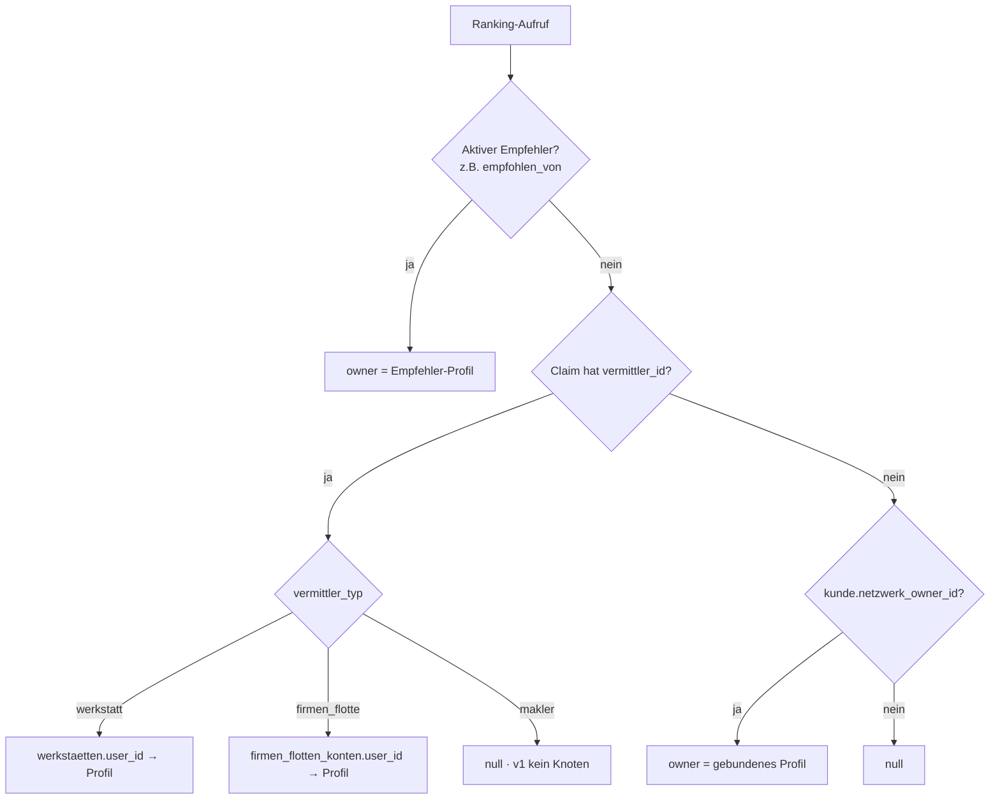

# Netzwerk-Verbindungen (Profi-Freundschaftsgraph) + Netzwerk-Ranking-Boost — Design

**Datum:** 2026-07-21
**Status:** Spec (brainstormed, wartet auf Review → Plan)
**Branch:** `kitta/netzwerk-verbindungen-freundschaft` (Basis `origin/staging`)
**Linear:** _TBD — AAR-Ticket anlegen und hier eintragen_
**Verwandt:** Spec 2 »Angebotsstruktur / SV-Freemium« (`2026-07-25-angebotsstruktur-sv-freemium-netzwerk-entitlement-design.md`) — definiert das Entitlement-Gate, das der Boost hier liest.
**Übergeordnet:** Epic-Overview »Netzwerk-Ökosystem« (`2026-07-27-netzwerk-oekosystem-epic-overview-design.md`) — enthält das *verfeinerte, einheitliche bidirektionale* Modell (immer-an-Netzwerk-Finder, Gate-immer-am-SV). Bei Abweichung gilt der Epic-Overview. Konkreter Flow: Spec 3 (`2026-07-27-sv-vermittlungs-flow-claim-lifecycle-design.md`).

---

## 1 · Kontext & Ziel

Profis der Plattform (Gutachter, Werkstätten, Flotten) sollen sich zu einem **echten Netzwerk** verbinden können — Freundschaftsanfrage → annehmen/ablehnen. Dieses Netzwerk ist eine **erstklassige soziale Primitive**, nicht bloß ein verstecktes Ranking-Hilfsmittel: es ist von Anfang an als **Substrat für spätere Chat-/Präsenz-Funktionen** und den **bestehenden Netzwerk-Feed** gebaut. Reißt man den Ranking-Teil heraus, bleibt trotzdem ein vollwertiges Netzwerk stehen. **Kein Fake.**

Auf diesem Graphen sitzt als **Consumer** ein **Ranking-Boost**: Kommt Geschäft aus dem Netzwerk (ein Gutachter empfiehlt eine Werkstatt; ein netzwerk-gebundener Kunde sucht eine Werkstatt/einen Gutachter), werden die **befreundeten Betriebe des jeweiligen Netzwerk-Ankers** in den bestehenden Matching-Engines **nach oben sortiert** — sofern sie qualifiziert sind. Sind sie es nicht, greift der normale Match (= „eine neue vorschlagen").

### Konkrete Nutzer-Szenarien (aus dem Brainstorming)

1. **Gutachter → Werkstatt:** Ein Gutachter empfiehlt im Fall eine Werkstatt. Seine befreundeten Werkstätten stehen ganz oben in den Vorschlägen.
2. **Werkstatt → Gutachter (andersherum):** Eine Werkstatt hat den Fall reingebracht; braucht der Fall einen Gutachter, stehen die befreundeten Gutachter der Werkstatt oben im Gutachter-Finder.
3. **Kunde bleibt im Netzwerk:** Ein Kunde, der über einen Netzwerk-Teilnehmer reinkam, bleibt dauerhaft an dessen Netzwerk gebunden. Bucht er später eine Werkstatt, rankt die befreundete Werkstatt vor allen anderen — außer sie kann das Angeforderte nicht, dann wird die nächstbeste vorgeschlagen.
4. **Flotte:** Flotten sind vollwertige Netzwerk-Knoten (können Anfragen senden) und zugleich Netzwerk-Anker für die Schäden ihrer Fahrzeuge/Fahrer.

---

## 2 · Nicht-Ziele (Scope-Grenzen)

- **Kein Chat in diesem Feature.** Der Graph wird chat-ready gebaut, aber Chat selbst ist ein Folge-Feature. Der **claim-gebundene Chat des Kunden bleibt unangetastet** und läuft weiter wie bisher.
- **Kein Umbau des bestehenden Netzwerk-Feeds** (`components/shared/netzwerk/*`). Er bekommt nur neue Tabs daneben.
- **Makler sind v1 keine Graph-Knoten.** Der Graph wird rollen-agnostisch gebaut, sodass Makler später ohne Umbau reinkommen; die UI-/Entry-Punkte beschränken v1 auf Gutachter/Werkstatt/Flotte.
- **Der Kunde ist kein Graph-Knoten** und bekommt **keine** Netzwerk-Funktionen (keine Freundschaftsanfragen, keine Netzwerk-Seite). Er trägt nur eine passive Bindung.
- **Keine Provisions-Änderung.** Der Boost berührt ausschließlich Outbound-Steuerung; Provision hängt am Inbound-Vermittler-SSoT und bleibt exakt wie sie ist (siehe §9).

---

## 3 · Kern-Entscheidungen (Decision Log)

| # | Entscheidung | Begründung |
|---|---|---|
| D1 | **Graph-Knoten = `profiles`-Zeilen** mit `rolle ∈ {gutachter, werkstatt, flotte}`. Rollen-agnostisch gebaut. | Ein Account-Hub, auf dem auch Chat/Feed sitzen. Entity-Tabellen verknüpfen 1:1 zu einem Profil (§5). |
| D2 | **Echtes Netzwerk nur für Profis**; Anfrage→annehmen/ablehnen/blockieren; eigene Netzwerk-Seite. | „Kein Fake"; chat-ready Primitive. |
| D3 | **Kunde = passive Bindung**, keine Netzwerk-Funktionen; Claim-Chat unverändert. | User-Vorgabe: „der Kunde soll wirklich nur im Netzwerk sein, nicht aktiv mitmischen." |
| D4 | **Integration = geteilte `applyNetzwerkPraeferenz`-Stufe** (Approach A), von beiden Findern + Empfehlungs-Batch konsumiert. | SSoT statt Duplikat (AGENTS.md §3); minimaler Eingriff in erprobte Score-Kerne; garantiert „Freund oben". |
| D5 | **Boost-Stärke = „Freund oben, Wahl frei"**: qualifizierte Freunde per Stable-Partition an die Spitze, Badge „aus deinem Netzwerk", Mensch wählt frei. | User-Wahl; erfüllt „muss besser ranken" ohne Bevormundung. |
| D6 | **Owner-Auflösung zweigleisig**: aktiver Empfehler (`empfohlen_von`) **oder** Claim-Vermittler/Kunden-Bindung. | Löst „und andersherum" mit einem Mechanismus. |
| D7 | **Kunden-Bindung = Sticky First-Touch** (persistente Spalte am Kunden-Profil, geseedet aus erstem Inbound-Vermittler). | User-Wahl; stärkstes „im Netzwerk bleiben". |
| D8 | **Discovery = Verzeichnis + Kontext-CTA**; Anfrage muss angenommen werden. | User-Wahl; Mix aus Wachstum und Spam-Schutz. |

---

## 4 · Datenmodell

### 4.1 Graph — `netzwerk_verbindungen`

```sql
create table public.netzwerk_verbindungen (
  id             uuid primary key default gen_random_uuid(),
  anfrager_id    uuid not null references public.profiles(id) on delete cascade,
  empfaenger_id  uuid not null references public.profiles(id) on delete cascade,
  status         text not null default 'offen'
                   check (status in ('offen','angenommen','abgelehnt','blockiert')),
  erstellt_am    timestamptz not null default now(),
  beantwortet_am timestamptz,
  constraint netzwerk_verbindungen_kein_selbst check (anfrager_id <> empfaenger_id)
);

-- Ein ungeordnetes Paar existiert nur einmal (verhindert Doppel- und Gegen-Anfragen):
create unique index netzwerk_verbindungen_paar_uniq
  on public.netzwerk_verbindungen (least(anfrager_id, empfaenger_id),
                                    greatest(anfrager_id, empfaenger_id));

create index netzwerk_verbindungen_anfrager_idx  on public.netzwerk_verbindungen (anfrager_id, status);
create index netzwerk_verbindungen_empfaenger_idx on public.netzwerk_verbindungen (empfaenger_id, status);
```

**Symmetrie:** Eine `angenommen`-Kante bedeutet gegenseitige Freundschaft; die Speicherung ist gerichtet (wer angefragt hat), die Bedeutung ungerichtet.

**Freund-Lookup als View** (macht Consumer-Queries trivial):

```sql
create view public.v_netzwerk_freunde as
  select anfrager_id  as profil_id, empfaenger_id as freund_id
    from public.netzwerk_verbindungen where status = 'angenommen'
  union all
  select empfaenger_id as profil_id, anfrager_id  as freund_id
    from public.netzwerk_verbindungen where status = 'angenommen';
```

### 4.2 Kunden-Bindung — Spalten an `profiles`

```sql
alter table public.profiles
  add column netzwerk_owner_id   uuid references public.profiles(id),
  add column netzwerk_owner_seit timestamptz;
```

- Gilt nur für `rolle = kunde`.
- **Einmalig** geseedet (First-Touch), danach unveränderlich (§8).
- `netzwerk_owner_id` ist ein **Profil** (der Vermittler-Profil-Knoten), kein Entity-Id.

### 4.3 Node-Identität — Entity ↔ Profil (verifiziert)

| Rolle | Entity-Tabelle | Profil-Verknüpfung |
|---|---|---|
| Gutachter | `sachverstaendige` | `sachverstaendige.profile_id → profiles.id` |
| Werkstatt | `werkstaetten` | `werkstaetten.user_id → profiles.id` |
| Flotte | `firmen_flotten_konten` | `firmen_flotten_konten.user_id → profiles.id` |

Annahme: 1 Betrieb = 1 Profil-Account (für v1 gültig). Multi-Account-Organisationen (`sv_buero`, `profiles.community_id`) sind v1 ausgeklammert.

---

## 5 · Architektur

### 5.1 Zwei-Schichten-Auflösung

Die Boost-Stufe braucht (a) **einen Owner-Profil-Knoten** und (b) den **Freund-Set im Kandidaten-id-Raum**.

**(a) Owner-Auflösung** — `resolveNetzwerkOwner(ctx) → profiles.id | null`



**(b) Freund-Auflösung in Kandidaten-id-Raum** — `resolveNetzwerkFreundKandidatIds(supabase, ownerId, zielRolle) → Set<string>`

```sql
-- zielRolle = 'werkstatt':
select w.id from public.werkstaetten w
  join public.v_netzwerk_freunde f on f.freund_id = w.user_id
 where f.profil_id = :ownerId;

-- zielRolle = 'gutachter':
select s.id from public.sachverstaendige s
  join public.v_netzwerk_freunde f on f.freund_id = s.profile_id
 where f.profil_id = :ownerId;
```

Ergebnis ist bereits im id-Raum der Kandidaten (`werkstaetten.id` bzw. `sachverstaendige.id`).

### 5.2 Die Boost-Stufe (pure, testbar)

```ts
// src/lib/netzwerk/apply-netzwerk-praeferenz.ts
export function applyNetzwerkPraeferenz<T extends { id: string; qualifiziert: boolean }>(
  kandidaten: T[],
  freundKandidatIds: ReadonlySet<string>,
): (T & { imNetzwerk?: boolean })[] {
  if (freundKandidatIds.size === 0) return kandidaten
  const freundeOben: (T & { imNetzwerk: true })[] = []
  const rest: T[] = []
  for (const k of kandidaten) {
    if (k.qualifiziert && freundKandidatIds.has(k.id)) freundeOben.push({ ...k, imNetzwerk: true })
    else rest.push(k)
  }
  return [...freundeOben, ...rest] // stable: Reihenfolge innerhalb beider Gruppen unverändert
}
```

- **Rein synchron**, keine DB → in Isolation testbar. Die DB-Auflösung (5.1) liegt beim Consumer.
- **Was „qualifiziert" heißt, definiert die jeweilige Engine** — die Stufe respektiert es nur. Bei Werkstatt = `passt`/über `HART_SCHWELLE`; bei SV = die Finder-Sichtbarkeits-/Match-Kriterien.

### 5.3 Consumer (3 Andock-Stellen)

| Consumer | Datei (Naht) | zielRolle | Owner-Quelle |
|---|---|---|---|
| Werkstatt-Empfehlungs-Batch | `src/app/gutachter/fall/[id]/_actions/werkstatt-empfehlung.ts` + `werkstatt/matching/rank-vorschlaege.ts:244` | `werkstatt` | aktiver Empfehler (`empfohlen_von`) |
| Werkstatt-Finder (Kunde/Flotte) | `src/lib/werkstatt/finder.ts` / `matching/lade-vorschlaege.ts` | `werkstatt` | Claim-Vermittler / Kunden-Bindung |
| Gutachter-Finder | `src/lib/actions/gutachter-finder-actions.ts` + `lib/finder/visibility.ts` | `gutachter` | Claim-Vermittler / Kunden-Bindung |

Jeder Consumer ruft nach seiner bestehenden Qualifikation+Rankstufe:
`kandidaten = applyNetzwerkPraeferenz(kandidaten, await resolveNetzwerkFreundKandidatIds(...))`.
Beim Batch wird das Ergebnis in `werkstatt_empfehlungen.rang` materialisiert.

### 5.4 Entitlement-Gate (Abhängigkeit → Spec 2)

Der Boost ist **zahlungspflichtig** (Angebotsstruktur, Spec 2). Vor dem Aufruf prüft der Consumer das Prädikat `istZahlenderNetzwerkPartner(ownerId)`:

- Owner ist **kein** zahlender Netzwerk-Partner → Boost **übersprungen** = normales Engine-Matching (aus SV-Sicht „zufällig disponiert"), **keine** Netzwerk-Sektion im Finder (§7.4).
- **v1-Scope:** das Gate greift für **SV-Owner** (Freemium ist ein SV-Produkt). Werkstatt-/Flotte-Owner sind v1 **ungegated** (noch kein Zahlprodukt) — Annahme, beim Review bestätigen.
- Prädikat = **SSoT in Spec 2**; Spec 1 konsumiert nur. Der soziale Graph (Freundschaften, Netzwerk-Seite) ist **nicht** gegated — nur Boost + Finder-Sektion.

---

## 6 · Ranking-Semantik & Kanten-Fälle

- **Kein qualifizierter Freund** → Liste unverändert = „neue vorschlagen". (Kein Sonderpfad nötig — fällt aus dem Algorithmus.)
- **Mehrere qualifizierte Freunde** → alle oben, untereinander in Engine-Reihenfolge (Distanz/Score).
- **Owner ist selbst Kandidat** → über den Freund-Set ausgeschlossen (Owner ist nicht sein eigener Freund); zusätzlich defensiv `id !== ownerEntityId` filtern.
- **`offen` / `abgelehnt` / `blockiert`** zählen **nicht** als Freund (View filtert auf `angenommen`).
- **Kein Owner auflösbar** (u.a. Makler-Vermittler v1) → `resolveNetzwerkFreundKandidatIds` liefert leeres Set → No-op, kein Fehler.
- **Flotte ist nie Kandidat** einer Zielrolle (man wird keiner Flotte „zugewiesen") — Flotte ist ausschließlich Owner/Anfrager. `zielRolle ∈ {werkstatt, gutachter}`.
- **UI:** eigene Finder-Sektion „Aus Ihrem Netzwerk" (§7.4) + Badge an geboosteten Kandidaten; nie erzwungene Vorauswahl.

---

## 7 · UI-Flächen

### 7.1 Beziehungs-Lifecycle
- States `offen → angenommen | abgelehnt`, plus `blockiert` (keine neuen Anfragen; gegenseitig aus Boost/Discovery ausgeblendet).
- Jeder Profi ↔ jeder Profi, **auch gleiche Rolle** (Werkstatt↔Werkstatt zulässig).
- Anfrage-Erhalt/-Annahme via bestehende Mitteilungs-/Notification-Infra.

### 7.2 Netzwerk-Seiten
- Bestehende `…/netzwerk`-Feeds bekommen Tabs **Feed | Verbindungen | Anfragen**.
- **Neu:** `/flotte/netzwerk` (Flotte war bislang nicht in `NETZWERK_HREF`).
- Makler-Feed bleibt, **ohne** Verbindungen-Tab (v1).

### 7.3 Discovery (D8)
- **Durchsuchbares Profi-Verzeichnis** (Name/Ort/Rolle).
- **„Vernetzen"-CTA im Kontext**, wo man einem Profi real begegnet: Finder-Ergebnisse, Fall-Beteiligte, Empfehlungs-Historie.
- Anfrage muss angenommen werden (Spam-Schutz).

### 7.4 Netzwerk-Sektion im Finder

> **VERFEINERT (27.07., s. Epic-Overview):** Primäre Surface ist der **Kunde-Portal-Finder** (immer an), nicht die SV-Dispositionsansicht. **Bidirektional** (Werkstatt-Finder *und* Gutachter-Finder), Gate **immer am SV** (Owner oder Kandidat). Der Empfehl-Batch ist dadurch abgelöst. Niemand wählt/empfiehlt vor — der gebundene Kunde bedient sich selbst im netzwerk-gescopten Finder. Details: Epic-Overview + Spec 3.

Der zentrale Sichtbarkeits-Ort des Boosts: **eine dedizierte, visuell abgesetzte Sektion** oben im Werkstatt-Finder (SV-Dispositionsansicht, wo der SV Werkstätten empfiehlt) — **„Aus Ihrem Netzwerk"** — mit den qualifizierten Partner-Werkstätten des SV (untereinander nach Distanz/Score), darunter ein Trenner + **„Weitere Werkstätten"** (die normale gerankte Liste).

- Wird **nur** gerendert, wenn (a) der Owner **zahlender Partner** ist (§5.4) **und** (b) ≥1 qualifizierter Partner in Reichweite. Sonst: keine Sektion, normale Liste — das ist der **sichtbare Free-vs-Paid-Unterschied** (Upsell-Fläche).
- Symmetrisch im **Gutachter-Finder** (Owner = Werkstatt/Flotte disponiert zu SV): analoge „Aus Ihrem Netzwerk"-Sektion (v1 ungegated, s. §5.4).
- Immer noch „Wahl frei" (D5): beide Gruppen sind wählbar, nichts wird erzwungen/vorausgewählt.

---

## 8 · Kunden-Bindung (Seeding, Sticky First-Touch)

> **VERFEINERT (27.07., WS-A):** Bindung ist **per-Claim** (`claims.netzwerk_owner_id`, bei Anlage aus Vermittler/SV-Origin gesetzt, sticky) **PLUS Kunden-Default** (`profiles.netzwerk_owner_id`, First-Touch, Fallback). Finder-Auflösung: Claim-Owner → sonst Kunden-Default → sonst kein Boost. Grund: ein Kunde kann mehrere Fahrzeuge aus *verschiedenen* Netzwerken haben (WS H). Analog zur gespeicherten `vermittler_id`-Attribution. Graph-Knoten = `profiles↔profiles` (bestätigt, nicht polymorph).

- **Seed-Zeitpunkt:** wenn ein Kunden-Profil aus einem Fall entsteht (vorhandene Herkunfts-Spur `profiles.entstanden_via` / `entstanden_aus_claim_id`; Anlage-Pfad um `createKundeAccount` herum — beim Plan verifizieren).
- **Seed-Wert:** `netzwerk_owner_id` = `resolveNetzwerkOwner` aus dem **Inbound-Vermittler** (`claims.vermittler_id`/`_typ` via `deriveVermittler`) des Herkunfts-Falls, in ein Profil aufgelöst. `netzwerk_owner_seit = now()`.
- **First-Touch, unveränderlich:** ist `netzwerk_owner_id` gesetzt, wird es nie überschrieben.
- **Präzedenz beim Ranking:** hat der **aktuelle** Fall einen Inbound-Vermittler, gewinnt dieser für genau diesen Fall; sonst greift die persistente Kunden-Bindung.
- **Makler-Vermittler:** liefert v1 `null` (kein Knoten) → keine Bindung, No-op. Wird automatisch aktiv, sobald Makler Knoten werden.

---

## 9 · Invarianten

- **Provisions-Neutralität (hart):** Der Boost verändert **nur** Outbound-Steuerung (welche Werkstatt/welcher SV vorgeschlagen wird). Provision hängt ausschließlich am **Inbound-Vermittler-SSoT** (`claims.vermittler_id`/`_typ`, `deriveVermittler`) und bleibt unberührt. Ein Freund kann sich über den Boost **keine** Provision erschleichen. → Regressionstest.
- **Claim-Chat unberührt:** Kunden-Kommunikation bleibt der bestehende claim-gebundene Chat.
- **Feed unberührt:** `components/shared/netzwerk/*` bleibt funktional wie bisher.

---

## 10 · Sicherheit

- **RLS** auf `netzwerk_verbindungen`: ein Profi sieht/verändert nur Kanten, an denen er beteiligt ist (`anfrager_id = auth.uid() OR empfaenger_id = auth.uid()`); `angenommen`/`abgelehnt`/`blockiert` nur durch den Empfänger (bzw. Beteiligte). Policies **PERMISSIVE mit explizitem `TO authenticated`** (RLS-Policy-Ratchet, AGENTS.md-Memory).
- **Grants:** neue public-Tabelle + View brauchen **explizite** Grants (neue Tabellen granten anon nichts — Default-Privileges-Wurzelfix). `authenticated` bekommt die nötigen Rechte; `anon` nichts.
- **DDL ausschließlich via Supabase-Plugin** `apply_migration` (Regel 2), Migration-File exakt nach getrackter Version benennen (Twin-Drift vermeiden).

---

## 11 · Test-Strategie

- **Unit** (`applyNetzwerkPraeferenz`): leeres Freund-Set (No-op), 1 Freund oben, mehrere Freunde stabil, unqualifizierter Freund bleibt unten, Owner-als-Kandidat ausgeschlossen, Stabilität der Rest-Reihenfolge.
- **Integration** je Consumer: Freund-Werkstatt rankt vor näherer Nicht-Freund-Werkstatt (qualifiziert); disqualifizierter Freund rankt **nicht** hoch (→ nächstbeste); Gutachter-Finder-Analogon.
- **Bindung:** First-Touch-Seed korrekt aus Vermittler; kein Überschreiben; Makler-Vermittler → keine Bindung.
- **Regression (Invariante):** Provision unverändert bei aktivem Boost.

---

## 12 · Implementierungs-Phasen

1. **Phase 1 — Graph + UI:** Tabelle/View/RLS/Grants; Lifecycle-Server-Actions (Result-Object-Pattern); Netzwerk-Tabs (Verbindungen/Anfragen) + `/flotte/netzwerk`; Verzeichnis + Kontext-CTA; Notifications. _Voll funktionsfähiges Netzwerk, noch ohne Ranking-Effekt._
2. **Phase 2 — Kunden-Bindung:** `profiles`-Spalten + First-Touch-Seeding im Kunden-Anlagepfad.
3. **Phase 3 — Boost:** `applyNetzwerkPraeferenz` + `resolveNetzwerkOwner`/`resolveNetzwerkFreundKandidatIds`; Verdrahtung in die 3 Consumer; „aus deinem Netzwerk"-Badge; Feature-Flag; Regressionstest Provision.

Feature-Flag deckt Phase 3 (Ranking-Effekt) ab; Phasen 1–2 sind inert bzgl. Matching.

---

## 13 · Offene Verifikationen (für den Plan)

- Ist `werkstatt_empfehlung_batches.empfohlen_von` ein `profiles.id`? (für Owner-Auflösung Flow A)
- Exakte Naht der SV-Kandidatenliste in `gutachter-finder-actions.ts` / `lib/finder/visibility.ts` (wo genau der Boost andockt) + trägt der SV-Kandidat `sachverstaendige.id`?
- Kunden-Anlagepfad aus einem Fall (`createKundeAccount`-Umgebung) — genauer Seed-Hook.
- Konkrete Notification-/Mitteilungs-API für Freundschaftsanfragen.
- Bestehendes Profi-Verzeichnis/Suche, das für Discovery wiederverwendet werden kann.
- `firmen_flotten_konten.user_id` vs. `firma_id` als Flotten-Knoten (User = Account-Owner erwartet; bestätigen).
